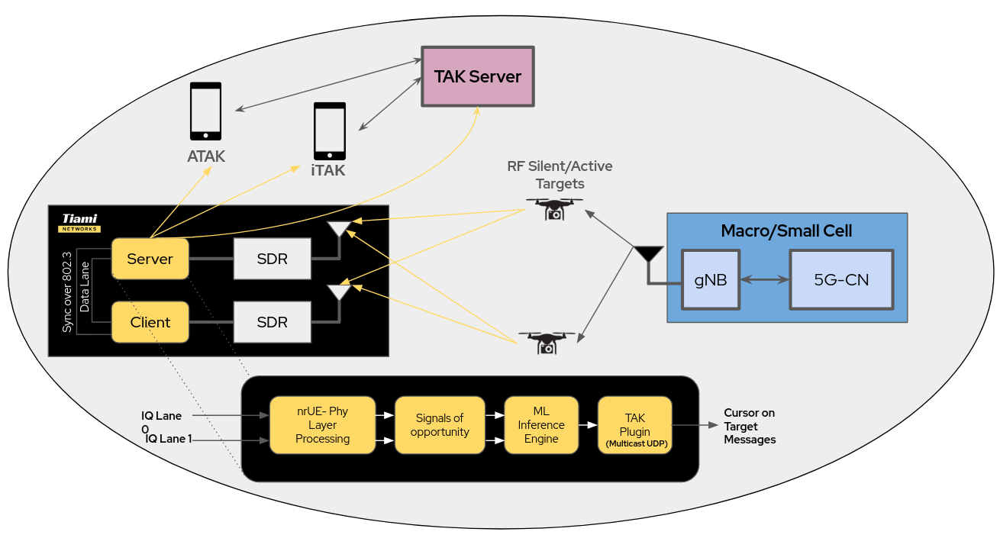

<table width="100%">
  <tr>
    <td><h1><strong>PolyEdge NR Release Quick Guide v25.1</strong></h1></td>
    <td align="right">
      
    </td>
  </tr>
</table>

The standalone edge deployment of PolyEdge for Integrated Sensing and Comms (ISAC) applications involves a server client paradigm to allow higher instantaneous BW across each receive channel for a virtual-MIMO structure. A TMUX session can be instantiated with 

`./start_polyedge_session.sh -s <session_name>`


<p align="center"><strong>Fig 1: System Architecture</strong></p>


Which starts 4 TMUX panes for managing and executing PolyEdge applications, the panes refer to:
1. Initializing nrUE
Initializing nrUE on the server by default should start the session on the client as well if they the ethernet connection is in place between client and server.

`tiami-init-nrUE` by default runs with options:
```bash
tiami-init-nrUE -E -r 106 --ue-fo-compensation --numerology 0 --band 71 -C 622850000 --CO 46000000 --sa --nokrnmod 1 -O ../../../targets/PROJECTS/GENERIC-NR-5GC/CONF/ue.conf --clock-source 0 --time-source 0
```

For quick start users must provide: 
numerology, band, center freq and carrier offset (if FDD),  sa (only sa supported currently).

The help section is provided below:
```bash
-----Help for section (root section)        	: 012 entries------
	--usrp-args: set the arguments to identify USRP (same syntax as in UHD)
	--single-thread-disable: Disables single-thread mode in lte-softmodem
	--dlsch-parallel: number of threads for dlsch processing 0 for no parallelization
	--offset-divisor: Divisor for computing OFDM symbol offset in Rx chain (num samples in CP/<the value>). Default value is 8. To set the sample offset to 0, set this value ~ 10e6
	--max-ldpc-iterations: Maximum LDPC decoder iterations
	--nr-dlsch-demod-shift: dynamic shift for LLR compuation for TM3/4 (default 0)
	-V: Enable VCD (generated file will is named openair_dump_eNB.vcd, read it with target/RT/USER/eNB.gtkw
	--uecap_file: path for UE Capabilities file
	--rrc_config_path: path for RRC configuration
	--ue-idx-standalone: Help string not specified
	--ue-if-id: Set the UE interface ID	--role: Set the role (master or slave)--------------------------------------------------------------------


-----Help for section (root section)        	: 012 entries------
	--usrp-args: set the arguments to identify USRP (same syntax as in UHD)
	--single-thread-disable: Disables single-thread mode in lte-softmodem
	--dlsch-parallel: number of threads for dlsch processing 0 for no parallelization
	--offset-divisor: Divisor for computing OFDM symbol offset in Rx chain (num samples in CP/<the value>). Default value is 8. To set the sample offset to 0, set this value ~ 10e6
	--max-ldpc-iterations: Maximum LDPC decoder iterations
	--nr-dlsch-demod-shift: dynamic shift for LLR compuation for TM3/4 (default 0)
	-V: Enable VCD (generated file will is named openair_dump_eNB.vcd, read it with target/RT/USER/eNB.gtkw
	--uecap_file: path for UE Capabilities file
	--rrc_config_path: path for RRC configuration
	--ue-idx-standalone: Help string not specified
	--ue-if-id: Set the UE interface ID	--role: Set the role (master or slave)--------------------------------------------------------------------

[CONFIG] (root): 32/36 parameters successfully set

-----Help for section (root section)        	: 036 entries------
	--rf-config-file: Configuration file for front-end (e.g. LMS7002M)
	--split73: Split 7.3 (below rate matching) option: <cu|du>:<remote ip address>:<remote port>	--thread-pool: Thread pool configuration:
  default no pool (runs in calling thread),
  list of cores, comma separated (negative value is no core affinity)
  example: -1,3 launches two working threads one floating, the second set on core 3	--phy-test: test UE phy layer, mac disabled
	--do-ra: test gNB  and UE with RA procedures
	--sa: run gNB in standalone mode
	--usim-test: use XOR autentication algo in case of test usim mode
	--clock-source: tells hardware to use a clock reference (0:internal, 1:external, 2:gpsdo)
	--time-source: tells hardware to use a time reference (0:internal, 1:external, 2:gpsdo)
	--tune-offset: LO tuning offset to use in Hz
	--wait-for-sync: Help string not specified
	--single-thread-enable: Disables single-thread mode in lte-softmodem
	-C: Set the downlink frequency for all component carriers
	--CO: Set the uplink frequency offset for all component carriers
	-a: Channel id offset
	-d: Enable soft scope and L1 and L2 stats (Xforms)
	-q: Enable processing timing measurement of lte softmodem on per subframe basis
	--numerology: adding numerology for 5G
	--band: band index
	--emulate-rf: Emulated RF enabled(disable by defult)
	--parallel-config: three config for level of parallelism 'PARALLEL_SINGLE_THREAD', 'PARALLEL_RU_L1_SPLIT', or 'PARALLEL_RU_L1_TRX_SPLIT'
	--worker-config: two option for worker 'WORKER_DISABLE' or 'WORKER_ENABLE'
	--noS1: Disable s1 interface
	--rfsim: Run in rf simulator mode
	--nokrnmod: (noS1 only): Use tun instead of namesh module
	--nbiot-disable: disable nb-iot, even if defined in config
	--chest-freq: Set channel estimation type in frequency domain. 0-Linear interpolation (default). 1-PRB based averaging of channel estimates in frequency.
	--chest-time: Set channel estimation type in time domain. 0-Symbols take estimates of the last preceding DMRS symbol (default). 1-Symbol based averaging of channel estimates in time.
	--nsa: Enable NSA mode
	--node-number: Help string not specified
	--usrp-tx-thread-config: having extra thead for usrp tx
	--nfapi: Change the nFAPI mode for NR
	--non-stop: Go back to frame sync mode after 100 consecutive PBCH failures
	--emulate-l1: Run in L1 emulated mode (disable PHY layer)
	--continuous-tx: perform continuous transmission, even in TDD mode (to work around USRP issues)
	--disable-stats: disable globally the stats generation and persistence--------------------------------------------------------------------

[CONFIG] (root): 4/5 parameters successfully set

-----Help for section (root section)        	: 005 entries------
	-R: Enable online log
	-g: Set the global log level, valid options: (4:trace, 3:debug, 2:info, 1:warn, (0:error))
	--telnetsrv: Start embedded telnet server
	--log-mem: Help string not specified
	--telnetclt: Help string not specified
--------------------------------------------------------------------

[ENB_APP]   nfapi running mode: MONOLITHIC
[CONFIG] TTracer: 3/3 parameters successfully set

-----Help for section (root section)        	: 003 entries------
	--T_port: tracer port
	--T_nowait: don't wait for tracer, start immediately
	--T_stdout: print log messges on console
--------------------------------------------------------------------
```

2. Initializing polyedge streamer
The PolyEdge streamer runs on a standalone docker container `polyedge` can can simply be invoked with `run-polyedge`  and is preloaded in the tmux session.

3. Initializing sync over 802.3
Data is managed across server and client with `rsync` and can be started with  `tiami-init-sync_antennas` and is preloaded in the tmux session.

4. Initializing visualizer.
The visualizer can be initiated with `stream-viz` and is preloaded in the tmux session.

Additional bash sessions can be initiated for task specific application such as sending COT messages: with `stream-tak`
Stream-tak must be initialized with the sensor's true lat/lon and heading in order to correctly interpolate the positions of the detected target, additionally users have control over which UDP ports to broadcast on as well as the broadcast IP. It can be initiated with 
```bash
stream-tak --sensor_lat 35.323918 --sensor_lon -79.248752 --sensor_heading 120.0 --broadcast_ip 255.255.255.255 --tak_port 4242 --broadcast_port 6969
```


