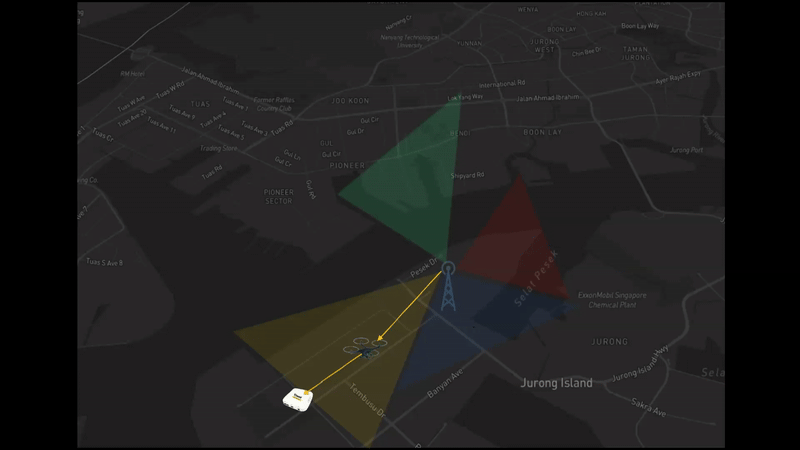
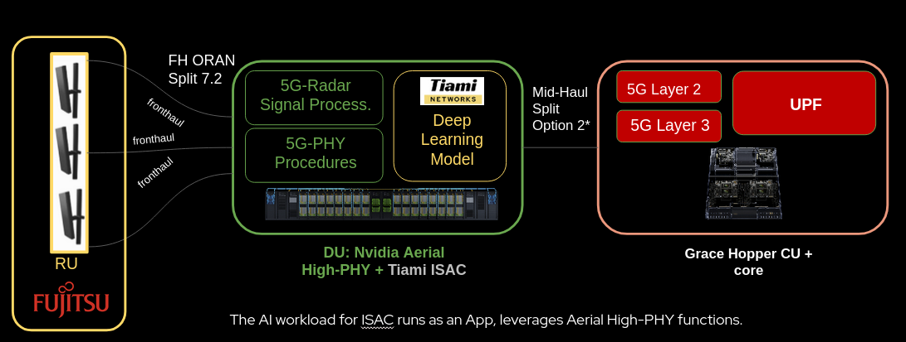
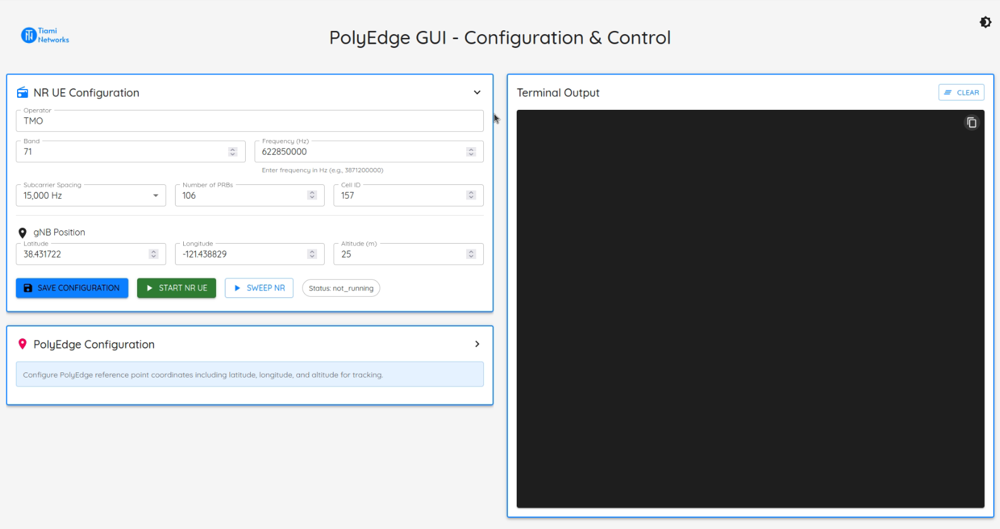

# PolyEdge Documentation

PolyEdge is passive ISAC (Integrated Sensing and Communications) software. It uses commercial LTE/NR and wideband RF as illuminators to detect and track targets in real time, with TAK integration for tactical situational awareness, REST/WebSocket/MQTT outputs for programmatic integration, and hardware-bound license-secured model inference.

Full per-topic guides render at **https://tiaminetworks.github.io/polyedge-docs/** ([Installation](installation.md), [Interacting with PolyEdge](interacting-with-polyedge.md), [Updating PolyEdge](updating-polyedge.md), [Operating PolyEdge](operating-polyedge.md), [Data Outputs & Integrations](data-outputs-and-integrations.md), [Licensing](licensing.md), [Model Finetuning](model-finetuning.md), [API Reference](api-reference.md)). This file is the single-document version for anyone reading straight off GitHub.

---

## Table of Contents

1. [Overview](#overview)
2. [The ISAC Engine](#the-isac-engine)
3. [Installation](#installation)
4. [Interacting with PolyEdge](#interacting-with-polyedge)
5. [Updating PolyEdge](#updating-polyedge)
6. [Configuration Files](#configuration-files)
7. [Starting the System](#starting-the-system)
8. [Data Outputs & Integrations](#data-outputs--integrations)
9. [Licensing](#licensing)
10. [Model Finetuning](#model-finetuning)

---

## Overview

PolyEdge is a real-time ISAC localization system that uses 5G NR downlink synchronization signals, and more broadly commercial LTE/NR/wideband RF, to track and locate targets, with TAK integration for tactical situational awareness. This is passive bistatic radar: the direct path from a tower you don't control is correlated against the path scattered off a target, without operating your own transmitter.

System components:

- **Real-time, non-cooperative target localization**: converts 5G NR frames to absolute target positions using ISAC.
- **TAK integration**: broadcasts target locations to tactical systems.
- **5G NR interface**: interfaces with 5G networks for signal data collection.
- **License validation**: secure operation with hardware-bound licensing.
- **Process orchestration**: concurrent management of the radio and ISAC Engine processes through the GUI's orchestrator API.

<p align="center">
  
</p>
<p align="center"><em>PolyEdge ISAC: default passive mode. A cellular illuminator you don't control, a target, and your receive site.</em></p>

<p align="center">
  
</p>
<p align="center"><em>PolyRAN: the active, gNB-integrated complement, with sensing co-located with the cellular stack.</em></p>

## The ISAC Engine

**The ISAC Engine is PolyEdge.** It is the core real-time processing engine that bridges 5G NR signal collection with ISAC localization. Everything else in this document, including the GUI, the REST/WebSocket/MQTT/TAK outputs, and license validation, is an interface to the ISAC Engine or a consumer of its output, not a separate peer component.

The ISAC Engine continuously processes downlink synchronization signal data and produces absolute coordinates using a combination of passive-radar-based processing and machine learning.

### How the ISAC Engine works

1. **5G NR frame ingestion.** PolyEdge receives raw downlink 5G NR frames. It replicates the complete L1-PHY stack, optimized for ISAC, to demodulate and use the downlink telemetry as the sensing resource.
2. **Real-time processing.** Signal processing and normalization.
3. **Model inference.** The trained model predicts absolute target positions.
4. **Output generation.** Results stream to CSV logs, WebSocket clients, the REST API, MQTT, and TAK systems.

### Configuration dependencies

The ISAC Engine requires both configuration files to operate.

From `nr_params.json`:

- `band`: determines signal processing parameters for the specific 5G band.
- `frequency`: sets the center frequency for 5G NR frame processing.
- `subcarrier_spacing`: configures the numerology used for signal analysis.
- `number_of_prbs`: defines the resource block processing scope.
- `gnb_location`: used as the illuminator reference point for coordinate transformations.

From `config.json`:

- `model_inference.enable`: controls whether target positioning is active.
- `model_inference.device`: sets the processing device (CPU or GPU).
- `model_inference.reference_point`: your sensor's position, used for coordinate transformations alongside `gnb_location` (see [Operating PolyEdge](operating-polyedge.md) for how the two relate).
- `output_directory`: where processed data and logs are written.
- `websocket.port`: real-time streaming configuration, default 8765.
- `rf_config.processing.max_queue_size`: 5G NR frame queue management.
- `rf_config.processing.file_ready_timeout`: file processing timing.

### Processing pipeline

```
          5G NR Frame
               │
               ▼
      ┌────────────────────────┐
      │   Signal Processing    │
      └────────────────────────┘
               │
               ▼
      ┌────────────────────────┐
      │ Cross-Ambiguity (CAF)  │
      └────────────────────────┘
               │
               ▼
      ┌────────────────────────┐
      │  Detection / Matched   │
      │        Filtering       │
      └────────────────────────┘
               │
               ▼
      ┌────────────────────────┐
      │     Model Inference    │
      └────────────────────────┘
               │
               ▼
     Absolute Target Position
```

### Real-time outputs

- **CSV logging**: continuous target position tracking log (`tracking_log.csv`).
- **WebSocket stream**: real-time coordinate broadcasting (port 8765 by default).
- **Console output**: processing statistics and system status.
- **TAK integration**: formatted messages for tactical displays.

### Performance indicators

Normal operation looks like:

- Consistent 5G NR frame processing, with no queue buildup.
- Target coordinates generated at regular intervals.
- Model confidence scores above 0.3, typically in the 0.3-0.8 range.
- No timeout errors in the processing queue.

Signs of a problem:

- Queue buildup indicates a processing bottleneck.
- Low confidence scores suggest poor RF conditions or a model mismatch.
- Missing target position output indicates a configuration or model issue.

### Startup sequence

1. **License validation**: verifies the license file before operation.
2. **Configuration loading**: reads `nr_params.json` and `config.json`.
3. **Model loading**: loads the trained target positioning model.
4. **Processing pipeline initialization**: initializes 5G NR frame processing and the inference pipeline.
5. **Output setup**: creates directories and initializes logging.
6. **Real-time operation**: begins continuous 5G NR frame processing.

## Installation

PolyEdge ships as four versioned `.deb` packages, installed in this order:

| Package | Installs |
|---|---|
| `polyedge-runtime` | Config contract, state, license placeholder |
| `polyedge-radio` | 5G NR UE stack (`nr-uesoftmodem`), `tiami-ringd`, radio libs (independent build chain) |
| `polyedge-streamer` | The ISAC Engine binary |
| `polyedge-interact` | The GUI web app (port 3000) |

Full detail: [Installation](installation.md).

## Interacting with PolyEdge

The GUI (`polyedge-interact`, port 3000; find the URL with `polyedge-interact-status`) provides Configuration, Monitoring, and Process Control. It is backed by a REST API you can also call directly. Full API reference: [API Reference](api-reference.md). Details: [Interacting with PolyEdge](interacting-with-polyedge.md).

<p align="center">
  
</p>
<p align="center"><em>Radio configuration screen: operator, band, frequency, subcarrier spacing, PRBs, cell ID, and gNB position.</em></p>

Radio configuration fields, as shown above:

| Field | Type |
|---|---|
| Operator | text (e.g. "TMO") |
| Band | 3GPP NR band number (e.g. 41, 71, 77); see [Operating PolyEdge](operating-polyedge.md) for enforced band/SCS combinations |
| Frequency | number in Hz (e.g. 3871200000) |
| Subcarrier spacing | dropdown (15/30/60/120/240 kHz) |
| Number of PRBs | number (1-275) |
| Cell ID | number |
| gNB position | latitude, longitude, altitude (meters) |

## Updating PolyEdge

Self-update fetches a version manifest and reinstalls the packages. It is triggered via `POST /api/system/update` from the GUI, and gated by `POLYEDGE_ALLOW_UPDATE=true` and a configured `POLYEDGE_UPDATE_MANIFEST_URL`. Details: [Updating PolyEdge](updating-polyedge.md).

## Configuration Files

### `nr_params.json`: 5G NR network parameters

```json
{
    "operator": "OPERATOR_NAME",
    "band": 66,
    "frequency": 2.15268e9,
    "subcarrier_spacing": 15e3,
    "number_of_prbs": 106,
    "gnb_location": {
        "lat": 38.433531,
        "lon": -121.437309,
        "alt": -4.8
    }
}
```

- `operator`: network operator name.
- `band`: 5G NR frequency band number (e.g. 66, 71, 78).
- `frequency`: center frequency in Hz.
- `subcarrier_spacing`: 15e3 (15 kHz) or 30e3 (30 kHz), depending on band.
- `number_of_prbs`: physical resource block count.
- `gnb_location`: **the illuminator's** GPS position (`lat`/`lon`/`alt`). This is the TX/tower you don't control, not your own sensor.

Common bands: **66** (AWS-3, 2.15268e9 Hz, 15kHz SCS, 106 PRBs), **71** (600MHz, 622850000 Hz, 15kHz SCS, 106 PRBs), **78** (3.5GHz, 3.68e9 Hz, 30kHz SCS, 75 PRBs).

### `config.json`: system and TAK configuration

```json
{
  "output_directory": "./tmp/output",
  "csv_file_path": "./tmp/output/tracking_log.csv",
  "license_file": "./license.lic",
  "log_level": "INFO",
  "websocket": {
      "enabled": true,
      "port": 8765
  },
  "model_inference": {
      "enable": true,
      "device": "cpu",
      "reference_point": {
          "latitude": 38.43575,
          "longitude": -121.43635,
          "altitude": -16.5
      },
      "normalization_type": "zerocenter"
  },
  "rf_config": {
      "processing": {
          "max_queue_size": 100,
          "file_ready_timeout": 5.0,
          "check_interval": 0.1
      }
  },
  "tak": {
      "enabled": false,
      "sensor_heading": 0.0,
      "cot_url": "udp://<host>:6969",
      "client_cert": "/path/to/client-cert.pem",
      "client_key": "/path/to/client-key.pem",
      "ca_file": "/path/to/ca-cert.pem"
  }
}
```

<p align="center">
  
</p>
<p align="center"><em>PolyEdge configuration screen: sensor reference point.</em></p>

- `model_inference.reference_point`: **your own sensor/receiver's** position. This is distinct from `gnb_location` above: that's the illuminator/TX, this is your RX. Do not confuse the two. They are not required to be identical, since bistatic geometry needs both points separately.
- `websocket.port`: real-time streaming, default 8765.
- `tak.cot_url`: the scheme decides the transport, independent of which system is on the receiving end. Use `tls://host:8089` for mutual-TLS (a real TAK server, or a **FAAD C2** (Forward Area Air Defense Command and Control) endpoint configured for TLS), which needs `client_cert`/`client_key`/`ca_file`. Use `udp://host:6969` for a FAAD C2 endpoint configured for plain UDP; no certificates required.

Full field reference: [Operating PolyEdge](operating-polyedge.md), [Data Outputs & Integrations](data-outputs-and-integrations.md).

## Starting the System

**Current (GUI/`.deb` deployments):** start via the GUI's Configuration page, or directly:

```bash
curl -X POST http://<host>:3000/api/process/init_nrUE -H "Content-Type: application/json" -d '{...nr_params...}'
curl -X POST http://<host>:3000/api/process/stream_main
```

Full walkthrough: [Operating PolyEdge](operating-polyedge.md).

**Common issues:** no GPS output means check reference point alignment. TAK connection failed means verify certificate paths and server connectivity. License errors mean check `license.lic` validity and expiry (see [Licensing](licensing.md)).

## Data Outputs & Integrations

Five equivalent output channels are available; pick whichever fits your integration: **REST** (`:8766`, poll), **WebSocket** (`:8765`, push, same message as REST's `/api/v1/latest`), **MQTT** (AWS IoT Core, per-target messages), **TAK/TLS** (CoT over mutual-TLS, to a real TAK server or a FAAD C2 endpoint configured for TLS), and **FAAD C2** (Forward Area Air Defense Command and Control, CoT over plain UDP for an endpoint configured that way, no certificates required). Full detail: [Data Outputs & Integrations](data-outputs-and-integrations.md).

## Licensing

A valid, hardware-bound `license.lic` is required to run the detection/positioning pipeline. Licenses are issued by Tiami Networks and bound to your specific hardware. Check status locally with `polyedge-license-status.sh`. Full detail: [Licensing](licensing.md).

## Model Finetuning

This page is being rewritten. Contact Tiami Networks for current information on model finetuning.
