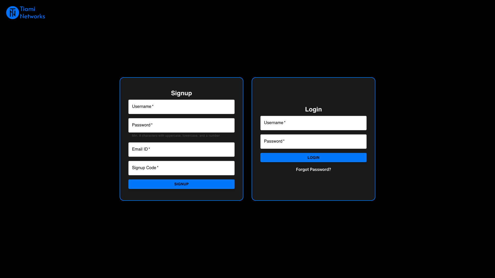
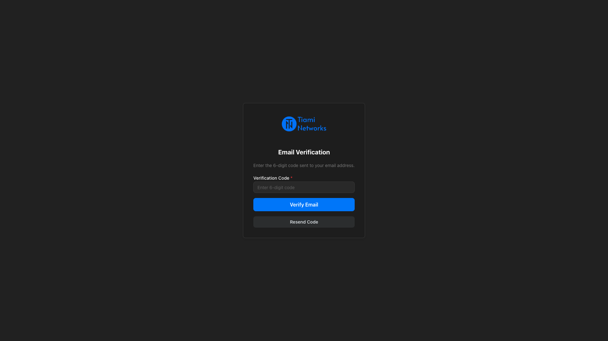
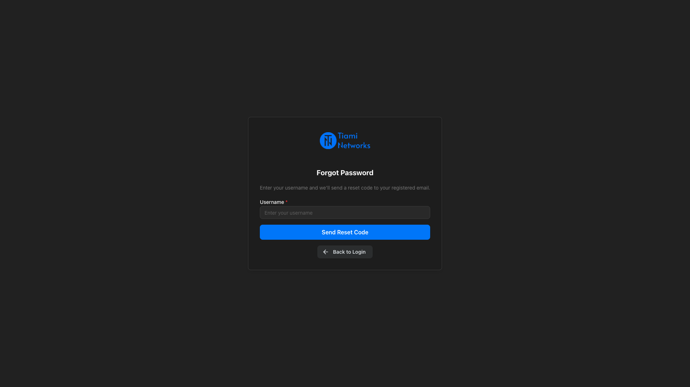
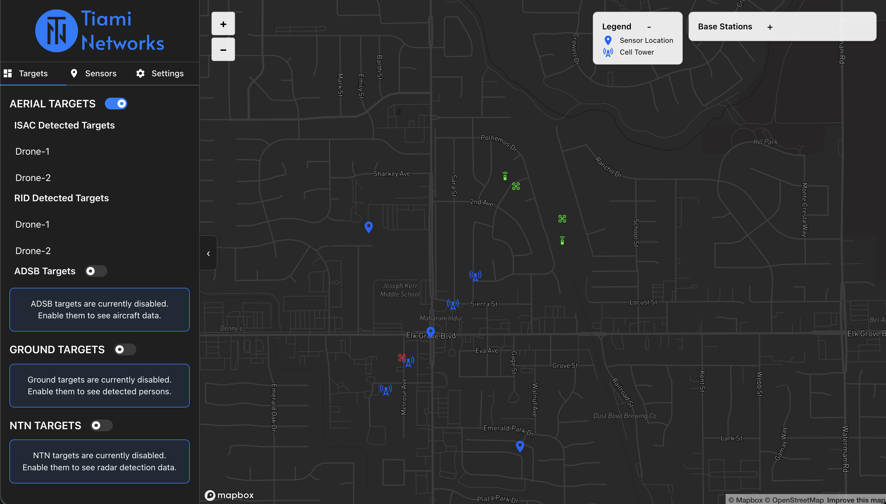
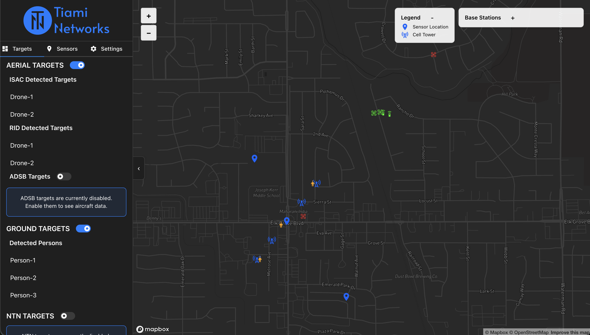
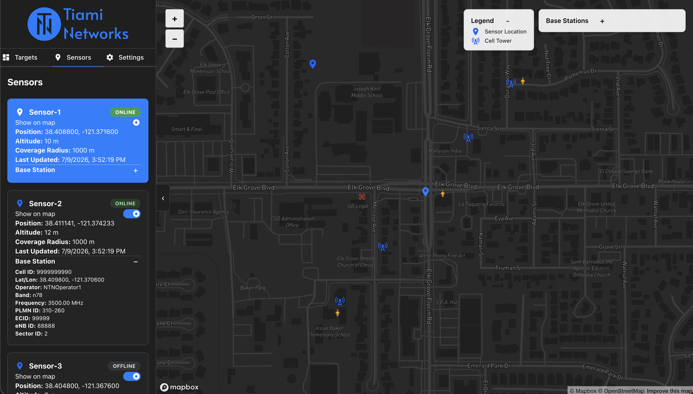
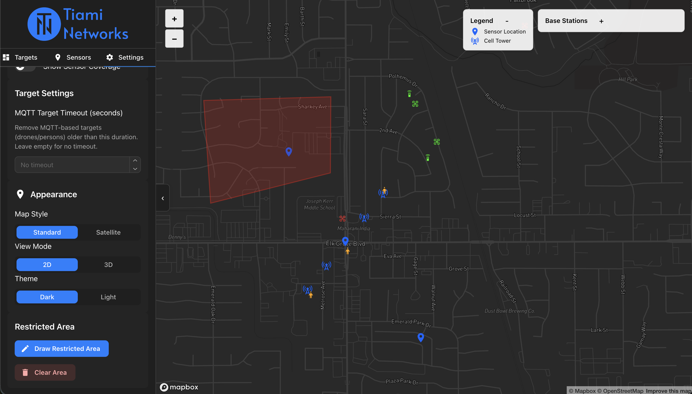

# Asset Tracker Dashboard

The **PolyEdge Asset Tracker Dashboard** is a real-time air-asset monitoring web application
built by Tiami Networks. It fuses live ADS-B aircraft positions with PolyEdge sensor
detections — passive radar (ISAC), Remote ID (RID), and non-terrestrial (NTN) targets —
on an interactive 2D/3D map.

**Production URL:** [drone-tracker.polyedge-analytics.com](https://drone-tracker.polyedge-analytics.com/)

---

## Getting access

Access is **invite-only**. Contact [sbabu@tiaminetworks.com](mailto:sbabu@tiaminetworks.com) with
your name, organization, and intended use case to receive a signup invite code.

---

## Sign up

1. Open the dashboard URL. The login page shows **Sign Up** and **Login** side by side.

  

2. Enter **Username**, **Password**, **Email**, and your **Signup Code** (invite code).
3. Submit sign up. A 6-digit verification code is sent to the provided email.
4. You are redirected to **Verify Email**. Enter the code to confirm your account.

  

Sign up is not open self-service — every account requires a valid invite code.

---

## Login

Use the **Login** card on the right (shown in the screenshot above).

1. Enter **Username** and **Password** on the login page.
2. The main dashboard loads with your assigned PolyEdge device data.

**Password reset:** use **Forgot Password** to request a code and reset the password

  

**Unverified accounts:** if you try to log in before verifying email, you are redirected back
to the verify-email page.

Log out from the **Settings** tab (clears session).

---

## Dashboard features

  

Sample dashboard view : aerial/ground/NTN target lists, map legend, and base-station overlay.

### Map and view

- **Full-screen map** — DeckGL layers over Mapbox GL (standard or satellite basemap).
- **2D / 3D toggle** — switch pitch, bearing, terrain, globe projection, and atmospheric effects.
- **Dark / light theme** — user-selectable color scheme.
- **Zoom controls** and a **map legend** for target types.

**Satellite + 3D view** (Settings → Map Style: Satellite, View Mode: 3D):

  

### Target categories (sidebar toggles)

| Category | What it shows | Data source |
|---|---|---|
| **Aerial targets** | ISAC drones (red), RID drones (green), ADS-B aircraft | `/api/drone`, `/api/adsb` |
| **Ground targets** | Individual persons | `/api/persons` |
| **NTN targets** | Non-terrestrial detections (purple helicopter icons) | `/api/drone` (`target_flag = 3`) |

Detection modes from PolyEdge sensors:

| Mode | Name | Description |
|---|---|---|
| 1 | ISAC | Passive radar localization |
| 2 | RID | Remote ID broadcast detections; shows operator position when available |
| 3 | Trigger | Gating mode — `trigger_flag` controls whether mode 1 tracks are included |

### Map layers

- **Target icons** — drones, helicopters, persons, aircraft (ADS-B), RID operator remotes.
- **Sensor markers** — per-sensor show/hide in the Sensors tab.
- **Sensor coverage circles** — configurable radius per sensor.
- **Cell tower (gNB) markers** — NR band, operator, PLMN, eNB ID, sector metadata.
- **Target flight paths** — historical trails (`PathLayer`).
- **Sensor-to-target beams** — arc lines from sensor to detected target.
- **Restricted area polygon** — user-drawn geofence.

### Sidebar tabs

**Targets tab** — ISAC, RID, ADS-B, ground persons, and NTN detections with category toggles:

  

**Sensors tab** — online/offline status, coverage radius, and linked gNB metadata:

  

- **Targets** — lists ISAC, RID, NTN, ADS-B, and ground person detections with click-to-highlight on map.
  Clicking a target shows lat/lon/alt, range, velocity, confidence, and RCS where available.
- **Sensors** — online/offline status, position, coverage radius, linked base
  station details, per-sensor visibility toggle.
- **Settings** — map style, 3D mode, theme, MQTT stale timeout, restricted-area tools, logout.

### Restricted areas and alerts

  

- **Draw** a polygon on the map (minimum 3 clicks) from Settings.
- **Save** to DynamoDB (company-scoped) or fall back to browser localStorage.
- **Breach alerts** — red notification when any target enters the polygon; target blinks on map.
- **Approach warnings** — yellow alert when a target is within 100 m of the boundary.
- **Browser notifications** — optional desktop alerts (permission requested on first load).

### Base stations panel

Collapsible overlay (top-right) listing all gNB/cell-tower metadata from active detections.

### Polling and refresh

- Drone and person targets: **200 ms** poll interval.
- ADS-B aircraft: **2 s** poll interval (no auth required).
- Map center for ADS-B defaults from IP geolocation with a Sacramento-area fallback.

---

## Architecture

| Component | Technology |
|---|---|
| Frontend | React, Vite, Mantine UI, DeckGL, Mapbox GL |
| Hosting | AWS S3 + CloudFront |
| API | AWS API Gateway + Lambda (`adsb-server.js`) |
| Auth | AWS Cognito (RS256 JWT, JWKS verification) |
| Data | DynamoDB (`UserLoginData`, per-tenant drone tables, `restricted-areas-drone-tracker`) |
| ADS-B feed | Upstream provider (adsb.lol) with retry and in-memory cache fallback |

---

## API reference

For programmatic access to dashboard data, see the [Asset Tracker Dashboard API]({{ site.baseurl }}/asset-tracker-dashboard/dashboard.html).
