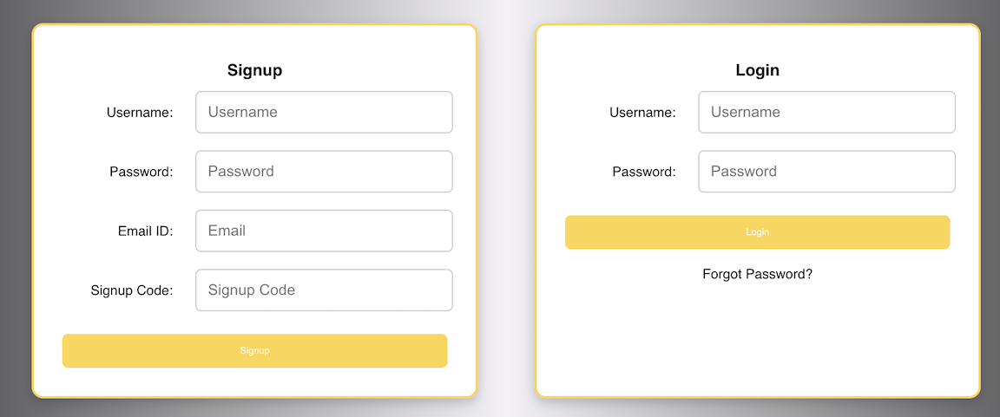
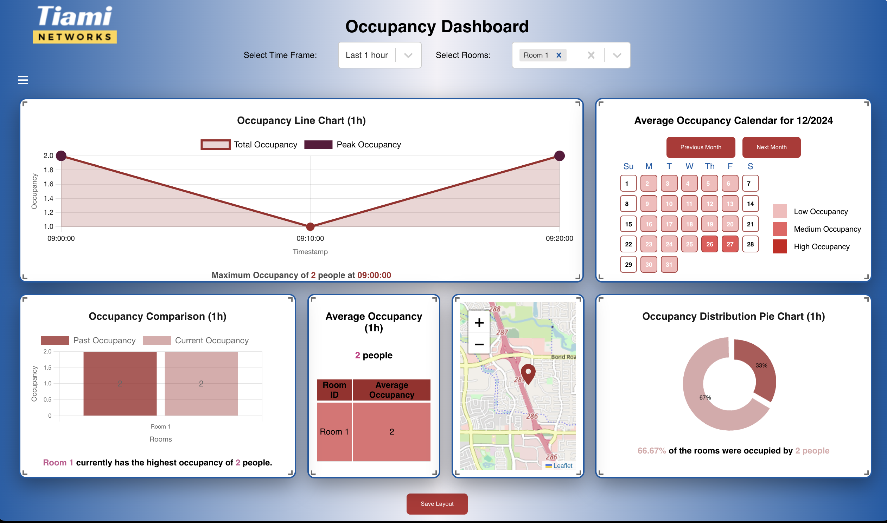
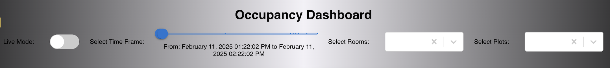

# Occupancy Tracking - Getting Started Tutorial

### Using an Edge Device Offered by Tiami Networks

#### Switching Device On
Power the device. Ensure the device voltage is within the 100-240V AC range for global compatibility.

- **For Tiami Networks Devices**: Follow the voltage range mentioned above.
- **For PolyEdge on User Devices**: Verify power compliance with **B2x0 devices from Ettus Research**.

---

### Configuring the Device

1. **Enter Device Encryption Password**: Use the provided encryption password to unlock the SDD.
2. **Connect to WiFi or Ethernet**:  
   - Use the Ethernet port to connect to the AWS endpoint.
   - **Important**: If utilizing WiFi sensing paradigms, WiFi ports will be disabled for data transfer. Ethernet is required to access AWS endpoint benefits.

---

### Accessing the Dashboard

1. **Sign up**: Enter the username, password, valid email address and provided signup code.
   
2. **Verify email address**: Click on the link sent to the given email address for verification.
3. **Access**: Once verified, the page is redirected to the dashboard with various plots for occupancy tracking.
   
4. **Customize**: All plots can be resized and shifted as required. Different timeframes and rooms can be selected to view data.
   

---
## Previous Steps

Return to [Setting Up PolyEdge](setting-up-polyedge.md).
