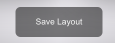
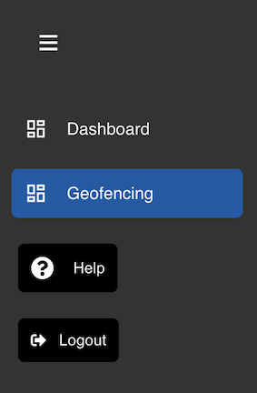
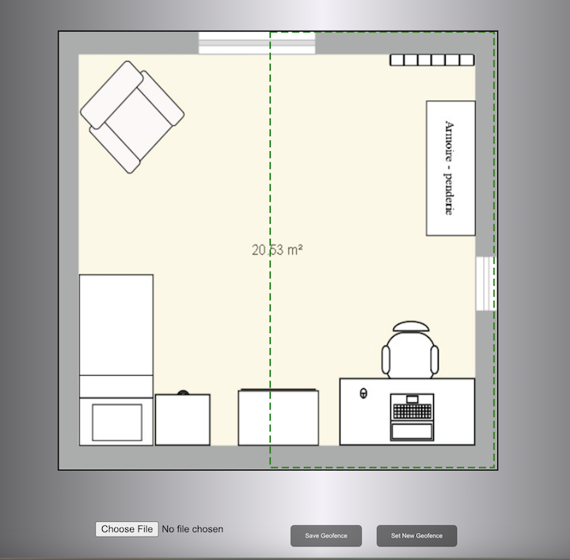
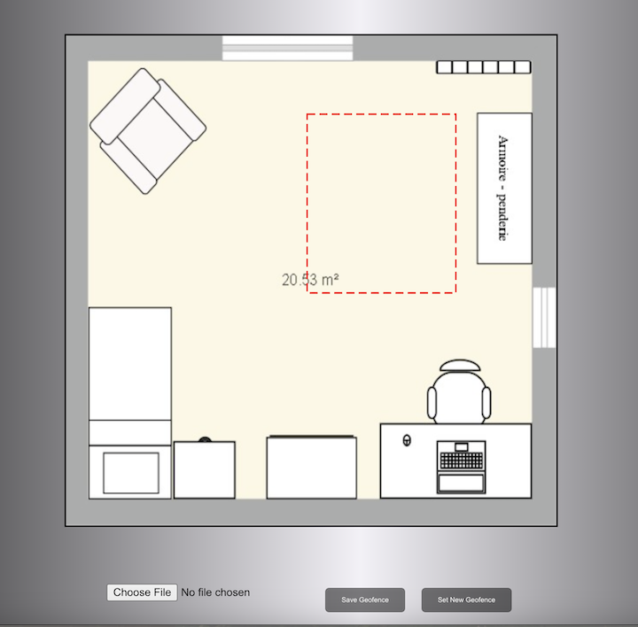
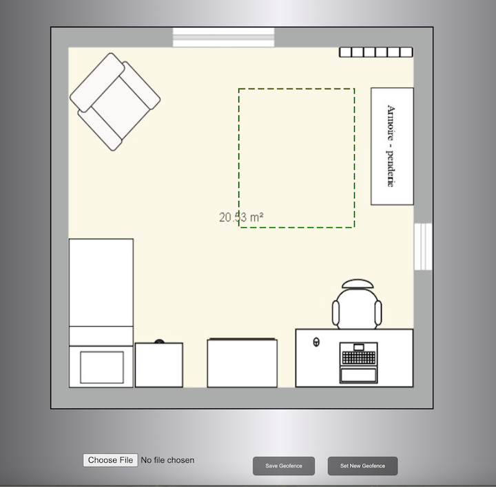
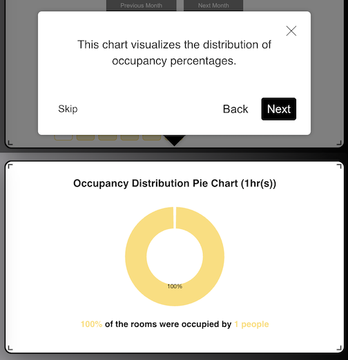
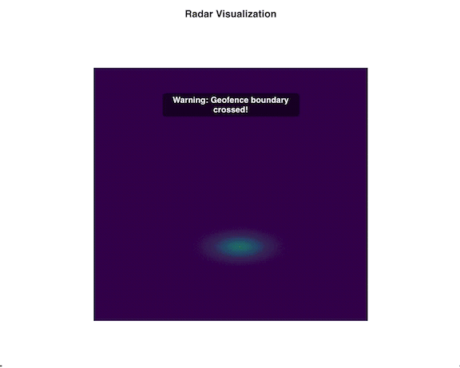

# Occupancy Tracking - Getting Started Tutorial

### Using an Edge Device Offered by Tiami Networks

#### Switching Device On
Power the device. Ensure the device voltage is within the 100-240V AC range for global compatibility.

- **For Tiami Networks Devices**: Follow the voltage range mentioned above.
- **For PolyEdge on User Devices**: Verify power compliance with **B2x0 devices from Ettus Research**.

---

### Configuring the Device

1. **Enter Device Encryption Password**: Use the provided encryption password to unlock the SDD.
2. **Connect to WiFi or Ethernet**:  
   - Use the Ethernet port to connect to the AWS endpoint.
   - **Important**: If utilizing WiFi sensing paradigms, WiFi ports will be disabled for data transfer. Ethernet is required to access AWS endpoint benefits.

---

### Accessing the Dashboard

1. **Open the link**: https://bit.ly/polyedge-analytics

2. **Sign up**: Enter the username, password, valid email address and provided signup code.

   

3. **Verify email address**: Click on the link sent to the given email address for verification.

4. **Access**: Once verified, the page is redirected to the dashboard with various plots for occupancy tracking.

   

5. **Customize**: 

   All plots can be resized and shifted as required. Click on Save Layout on the bottom of the page when done.

   
   
   Different timeframes and rooms can be selected to view data. Live Mode can be enabled for upto 2 minutes.

   

6. **Geofence Boundary**: Custom geofence boundary can be set as required. 
   
   Open the Geofencing section on the sidebar

   

   Initially, there is a default room plan with a geoboundary already set.

     

   To upload a custom room plan, click on the Choose File button on the bottom of the page. 

   To set a new geofence, click on the Set New Geofence button on the bottom of the page and set the boundary as required.

     

   Once the new geofence has been set, click on the Save Geofence Button. The red dotted box will turn green once the boundary has been set.

     

7. **Tutorial for the dashboard**:

   Click on the help button in the sidebar.

   

   View the step-by-step explanation of the dashboard

   

8. **Logout**: Click on the logout button in the sidebar when done.
---

### Radar Hue Visualzation

The visualization tracks the occupant's movement within the room. A warning is issued if the occupant crosses the geo-boundary.

---

## Previous Steps

Return to [Setting Up PolyEdge](setting-up-polyedge.md).
