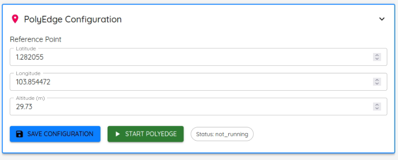

# Operating PolyEdge

This page covers starting the radio, setting TX/RX locations, and the configuration items that control detection. Full field-by-field reference: [API Reference](api-reference.md) → Orchestrator API, §6.

Requires `polyedge-radio` installed (see [Installation](installation.md)) and a valid license (see [Licensing](licensing.md)).

## TX vs. RX location — don't confuse these

PolyEdge is a **passive bistatic** system: it listens to an illuminator you don't control (the TX) and correlates that against what scatters off targets, received at your sensor (the RX). Two separate, distinct config fields:

| Field | Meaning | Where it lives |
|---|---|---|
| `gnb_location` (`lat`, `lon`, `alt`) | The illuminator's position — the cell tower / gNB you're using as a reference signal source. Not something you control, just something you measure or look up. | NR parameters (`nr_params.json`) |
| `reference_point` (`latitude`, `longitude`, `altitude`) | Your own sensor/receiver's position. | Stream configuration (`config.json`'s `model_inference.reference_point`) |

Get this wrong and range/bearing calculations will be wrong even if signal processing is working perfectly — these two points define the bistatic geometry.

## NR parameters

Set via the GUI's Configuration page, or `POST /api/config/nr_params`:

| Field | Meaning |
|---|---|
| `operator` | Network operator label (e.g. `"TMO"`, `"ATT"`, `"VZW"`) |
| `band` | 3GPP NR band number (e.g. 71, 78) |
| `frequency` | DL carrier center frequency, Hz |
| `subcarrier_spacing` | SCS in Hz — band-dependent, see the validation table below |
| `number_of_prbs` | Physical resource block count (1–275) |
| `cell_id` | Physical cell ID, or a list of candidate PCIs to scan |

### Band / SCS validation

| Band | Allowed SCS (Hz) |
|---|---|
| 71 | 15000 |
| 78, 79 | 15000, 30000 |
| 257, 258, 260 | 15000, 30000, 60000 |

An invalid combination is rejected at radio-start time.

## Starting the radio

From the GUI's Configuration page, or directly:

```bash
curl -X POST http://<host>:3000/api/process/init_nrUE \
  -H "Content-Type: application/json" \
  -d '{
    "operator": "TMO", "band": 71, "frequency": 622850000,
    "subcarrier_spacing": 15000, "number_of_prbs": 106, "cell_id": 842,
    "gnb_location": {"lat": 38.431722, "lon": -121.438829, "alt": 25.0}
  }'
```

Poll `GET /api/processes` until `init_nrUE.status == "running"`, then start the detection pipeline:

```bash
curl -X POST http://<host>:3000/api/process/stream_main
```

Stop in reverse order: `stream_main` first, then `init_nrUE`.

## Stream / detection configuration

`config.json`'s `model_inference` block controls the detection/positioning pipeline:

<p align="center">
  
</p>
<p align="center"><em>PolyEdge configuration screen — sensor reference point (this is the RX position, distinct from gNB position above).</em></p>

| Field | Meaning |
|---|---|
| `enabled` | Turn model-based positioning on/off |
| `device` | `cpu` or `cuda` |
| `reference_point` | Your sensor's lat/lon/alt (see TX vs RX above) |
| `use_case` | e.g. `"gps"` — selects which trained model/normalization to use |

`websocket_port` (default 8765) and the `tak` and MQTT blocks are covered in [Data Outputs & Integrations](data-outputs-and-integrations.md).

## Presets

Named configuration bundles can be applied without editing files directly — `GET /api/config/presets` to list, `POST /api/config/select_presets` to apply. See the [API Reference](api-reference.md) for the full presets contract.
