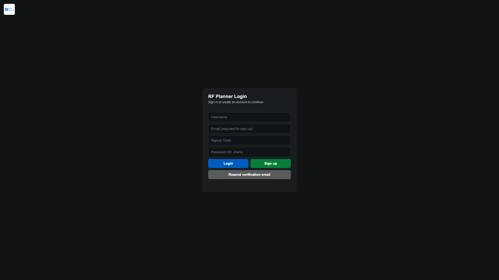
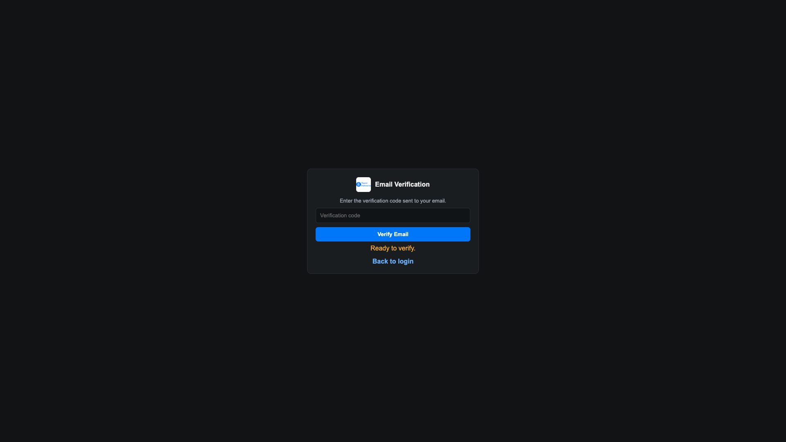
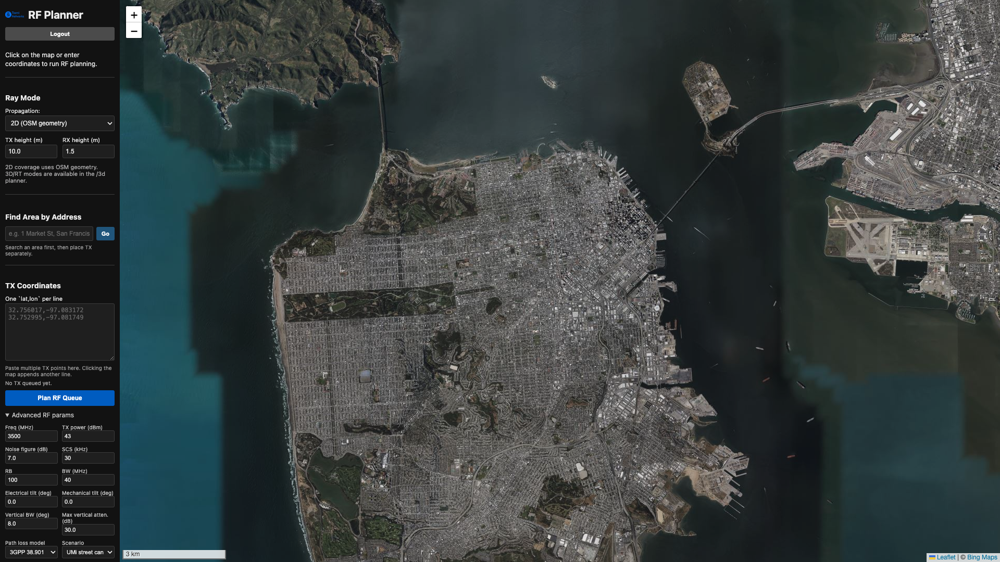
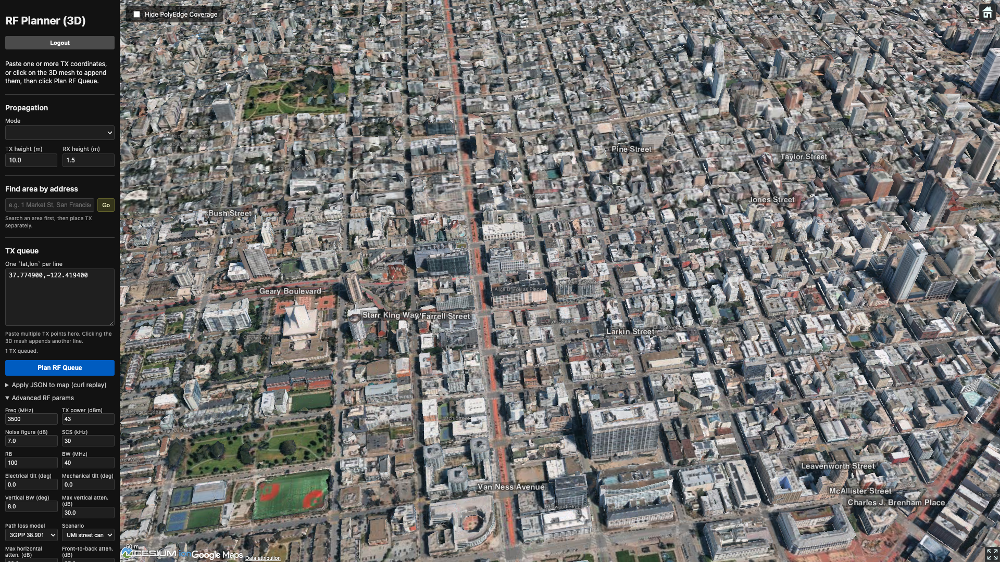
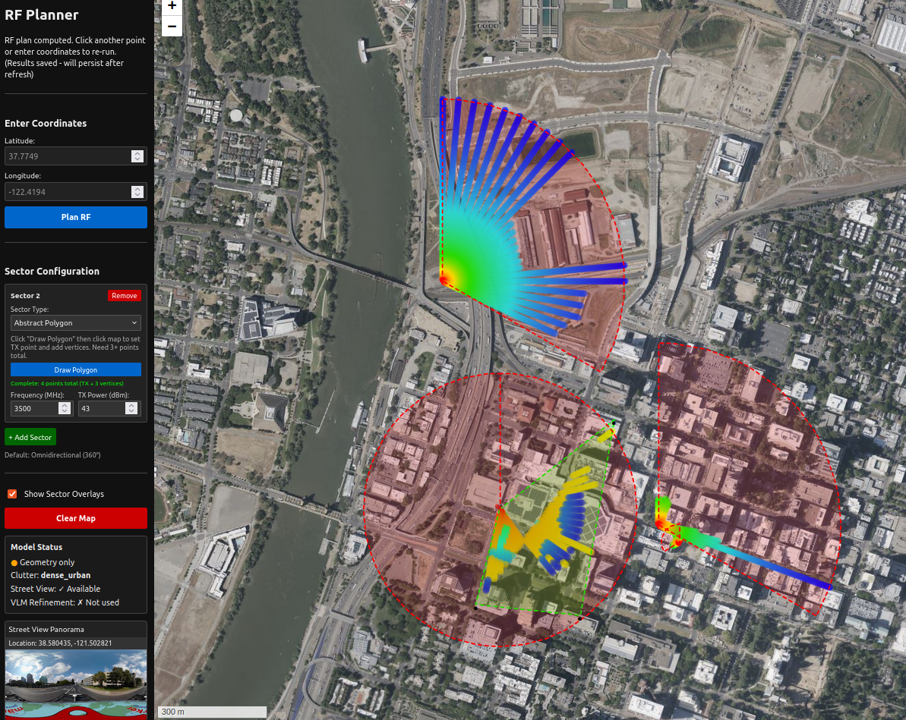

# Agentic RF Planner

The **Agentic RF Planner** is an RF planning system that combines 360° street-level vision,
OpenStreetMap building data, and propagation models to compute coverage heatmaps, sector overlays,
and multipath ray traces. It is used to assess 5G NR coverage before deployment and to recommend
PolyEdge sensor placement locations.

---

## Getting started locally

```bash
cd rf-planning
python3 -m venv ~/RFP && source ~/RFP/bin/activate
pip install -e .
uvicorn agentic_rf_planner.api.rest:app --reload
```

Open `http://localhost:8000/2d` for the 2D planner or `http://localhost:8000/3d` for 3D Cesium.
**Production URL:** [isac-planner.polyedge-analytics.com](https://isac-planner.polyedge-analytics.com/)
In production, CloudFront serves `login.html` as the default root.

---

## Sign up

<p align="center">
  
</p>

1. Open the app URL. The login page offers **Login** and **Sign Up** on the same screen.
2. For sign up, enter **Username**, **Email**, **Password**, and an optional **Signup Code**
   (required when `SIGNUP_CODES` is configured on the server).
3. Submit → `POST /api/auth/signup` creates a Cognito user. Status returns
   `verification_required`.
4. Enter the email verification code inline, or visit `/verify?username=...`.

<p align="center">
  
</p>

5. `POST /api/auth/verify-email` confirms the account.

---

## Login

Use **Login** on the same screen (screenshot above). After a successful login you are redirected
to the planner UI.

1. Enter **Username** and **Password** → `POST /api/auth/login`.
2. On success, the JWT is stored in `localStorage` (`rf_planner_auth_token`) and sent as
   `Authorization: Bearer <token>` on subsequent API calls.
3. Redirect depends on Cognito group membership:
   - **`external` group** → `/external` (simplified ISAC Planner, 3D OSM only)
   - **All other users** → `/2d` (full 2D Leaflet planner)
4. **Logout** clears `localStorage` and returns to `/login`.
5. Unverified users receive HTTP 403 `"User not verified"` on login.

**Resend verification:** `POST /api/auth/resend-verification` from the login or verify page.

---

## User interfaces

| URL | Planner | Map engine | Who uses it |
|---|---|---|---|
| `/2d` | 2D Leaflet planner | Bing Aerial satellite tiles | Internal users (default after login) |
| `/3d` | 3D Cesium planner | Google Photorealistic 3D Tiles | Internal users (3D / ray-trace modes) |
| `/external` | ISAC Planner (simplified) | Google 3D Tiles, fixed 3D OSM mode | `external` Cognito group |

**2D planner** — address search, TX queue, sector config, and Plan RF Queue:

<p align="center">
  
</p>

**3D planner** — Cesium photorealistic mesh, street labels, and ray-trace controls:

<p align="center">
  
</p>

---

## Planner features

### Propagation modes

| Mode | Description |
|---|---|
| `2d_osm` | 2D coverage using OSM building footprints (default in 2D) |
| `2d_rt` | 2D multipath ray trace on the Leaflet map |
| `3d` / `3d_osm` | Height-aware 3D coverage on Cesium mesh + OSM |
| `3d_rt` / `3d_rt_osm` | 3D multipath ray tracing with wall reflections |

Selecting a 3D mode in the 2D UI auto-redirects to `/3d`.

### TX placement and batch planning

- **Click the map** to add transmitter coordinates to a TX queue (does not auto-run).
- **Paste coordinates** as multi-line `lat,lon` in the sidebar textarea.
- **Address search** with autocomplete flies the map to a location.
- **Plan RF Queue** processes every TX point in the queue sequentially.

### Sector configuration

Three sector types define coverage shape:

1. **Omnidirectional (360°)** — full circle around the TX point.
2. **Angle-based** — sector defined by start and end azimuth angles.
3. **Abstract polygon** — custom shape drawn on the map (TX is the polygon origin).

Per-sector settings include frequency (MHz), TX power (dBm), azimuth, horizontal/vertical
beamwidth, electrical/mechanical tilt, and attenuation limits. Multiple sectors with different
frequencies can be planned in one batch. Toggle **Show Sector Overlays** to preview boundaries.
The 2D heatmap screenshot below shows a sector overlay (red arc) alongside the RSRP legend.

### Advanced RF parameters

Collapsible panel for noise figure, subcarrier spacing, resource blocks, channel bandwidth,
MIMO mode (SISO/SIMO/MISO/MIMO), link adaptation, antenna gains, path-loss model (3GPP 38.901 or
legacy), propagation scenario, shadow/diffraction losses, building material attenuation, and
ray-termination RSRP threshold. Defaults load from `configs/rf.params.yaml` via `GET /api/rf-params`.

### Results visualization

- **RSRP heatmap** — color-coded signal strength (red/orange = strong, blue/cyan = weak).
- **RSRP legend** — shows the dBm scale for the current plan.
- **Sector overlays** — circles, arcs, or polygons per configured sector.
- **PolyEdge markers** — recommended UE/sensor deployment points (count 1–20).
- **Snapped TX marker** — street-snapped transmitter location with snap line.
- **Panorama thumbnail** — 360° street view when Mapillary API key is configured.
- **Metadata sidebar** — planning diagnostics, timing, and world-model summary.

**2D heatmap example** (Leaflet planner, sector overlay + RSRP legend):

<p align="center">
  
</p>

**3D heatmap example** (Cesium planner on Google Photorealistic 3D Tiles):

<p align="center">
  
</p>

### 3D-specific features

- **Google Photorealistic 3D Tiles** (requires `GOOGLE_MAPS_API_KEY`).
- **Mesh ray profiles** — auto-generated radial profiles cached via `/api/mesh-profiles/*`.
- **3D ray tracing panel** — place TX/RX on mesh, configure bounces, launch rays, auto-lock steering.
- **SHIFT+click** quick RX placement.
- **Street labels** overlay from OSM (`GET /api/roads/labels`).
- **Perspective / bird's-eye** view toggle.

### Export and utilities

- **Export ZIP** — screenshot, metadata, and plan results (`html2canvas` + `export_utils.js`).
- **Clear Map** — removes heatmaps and overlays; cancels in-flight requests.
- **Apply plan JSON** — paste API response for replay/debug.
- Last result persisted to `localStorage` for page refresh recovery.

---

## Typical workflow

<p align="center">
  
</p>

1. **Log in** → land on `/2d` (or `/external` for external users).
2. **Navigate** — search an address or pan/zoom the map.
3. **Set TX** — click the map or enter coordinates in the queue.
4. **Configure sectors** (optional) — add 360°, angle, or polygon sectors.
5. **Tune parameters** — ray mode, heights, advanced RF knobs.
6. **Plan RF Queue** — submits async jobs (`POST /api/plan/submit`), polls status every 15 s.
7. **Review** — heatmap, legend, sector overlays, PolyEdge recommendations.
8. **Iterate** — add more TX points, toggle overlays, export, or clear and replan.

For 3D ray tracing: switch to a 3D mode → redirect to `/3d` → ensure mesh profiles exist →
set RX (SHIFT+click) → optionally launch rays separately → Plan RF Queue.

---

## API reference

For programmatic access to planning and auth endpoints, see the [RF Planner API]({{ site.baseurl }}/rf-planner/rf-planner.html).
