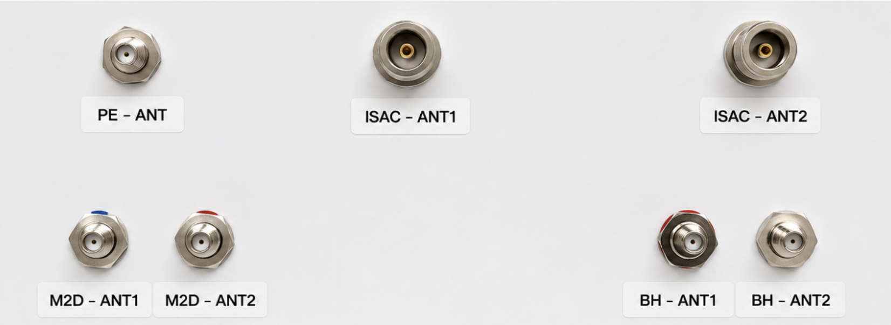
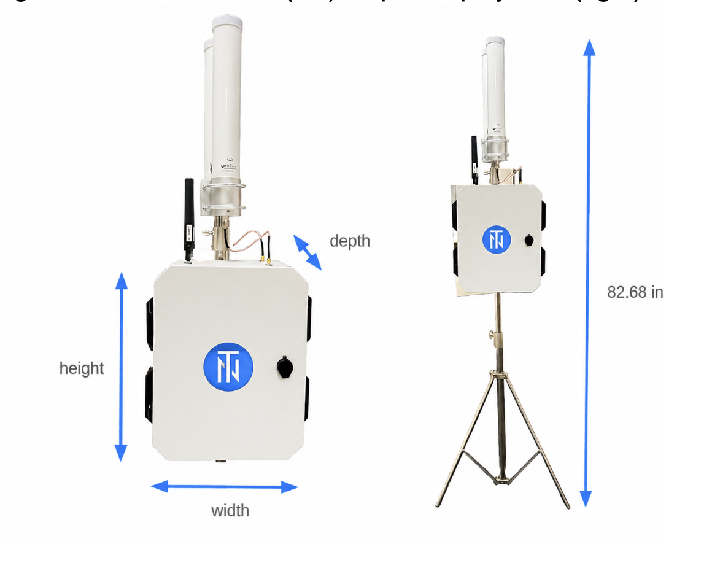

# PolyEdge Sensor

## Overview

Tiami's PolyEdge Sensor is a passive bistatic sensing platform designed to operate
independently of the 5G network. It leverages ambient 5G waveforms as signals of opportunity
to enable radar-like functionality for object detection, motion tracking, and spatial
awareness. Without requiring attachment or authentication to the network, the sensor performs
Integrated Sensing and Communication (ISAC)-aligned tasks.

## Functional specification

| Property | Value |
|---|---|
| RX sensitivity | −85 dBm @ 1 MHz |
| Number of RX | 2 RX |
| Outdoor installation | Yes |
| Supported technology | 5G (SA, NSA) |
| Frequency range | FR1 (600 MHz – 6000 MHz) |
| Max iBW instantaneous / oBW occupied bandwidth | ~28 MHz per channel |

## Antenna Specifications

| Property | Value |
|---|---|
| Frequency range | 550 MHz – 6000 MHz |
| Antenna gain | 9 dBi (omnidirectional) |
| Polarization | Vertical |
| Horizontal Beamwidth | 360° |
| Vertical Beamwidth | 9° – 11° |
| VSWR (max) | < 1.6:1 |
| Impedance | 50 Ω |
| Maximum input power | 100 W |
| Lightning protection | DC short |
| Connector type | Integral N-Female |
| Radome material | Fiberglass |
| Radome diameter | 2.04 in. (51.8 mm) |
| Length | 19.8 in. (0.50 m) |
| Weight | 1 lb (0.45 kg) including bracket |
| Mounting | 1.4 in. (35 mm) to 2.0 in. (50 mm) diameter mast |

## PolyEdge Sensor Interfaces

| Interface | Label on HW | Qty | Connector | Notes |
|---|---|---|---|---|
| Power Connector| AC | 1 | 3-prong plug | AC input, 100–230 V |
| Grounding | — | 1 | M5 screw | Chassis grounding point |
| PolyEdge Communication Interface| BH-ANT1 | 1 | mini-SMA | 50 Ω |
| PolyEdge Communication Interface | BH-ANT2 | 1 | mini-SMA | 50 Ω |
| PolyEdge Sensing Interface | ISAC – ANT1 | 1 | N-Female | 50 Ω |
| PolyEdge Sensing Interface | ISAC – ANT2 | 1 | N-Female | 50 Ω |
| PolyEdge Sensing mode 2 | M2D – ANT1 | 1 | mini-SMA | 50 Ω |
| PolyEdge Sensing mode 2 | M2D – ANT2 | 1 | mini-SMA | 50 Ω |
| PolyEdge LAN | PE – ANT1 | 1 | mini-SMA | 50 Ω |

  

<em>Figure 1 — PolyEdge sensor interfaces.</em>

## Electrical specifications

| Property | Value |
|---|---|
| Nominal supply voltage | 110 V AC |
| Nominal input voltage range | 100 V AC |
| Extended input voltage range | 90 – 264 V AC |

> **Note:** The sensor is supplied with power adapters for European operation where required.

### Power consumption

| Property | Value |
|---|---|
| Maximum power consumption | 65 W |
| Typical power consumption | 45 W |

## Mechanical dimensions and weight

| Property | Value |
|---|---|
| Height | 983.3 mm (38.7 in.) |
| Width | 305 mm (13.8 in.) |
| Depth (no bracket) | 159 mm (6.26 in.) |
| Depth (with bracket) | 239 mm (9.41 in.) |
| Weight | ~20 kg (44 lbs) |

  

<em>Figure 2 — Sensor dimensions (left) and tripod deployment (right).</em>

### Installation options
- **Pole mount** — see [Sensor Installation and Mounting]({{ '/sensor-installation.html' | relative_url }})
- **Wall mount** — see [Sensor Installation and Mounting]({{ '/sensor-installation.html' | relative_url }})
- **Tripod** — recommended for temporary field deployments (see [Sensor Installation and Mounting]({{ '/sensor-installation.html' | relative_url }}))

## Environmental specifications

| Property | Value |
|---|---|
| Max outdoor temperature (shade, fan or 6.7 mph wind) | 55°C (131°F) |
| Max outdoor temperature (sun, fan or 6.7 mph wind) | 50°C (122°F) |
| Max indoor temperature | 45°C (113°F) |
| Min operational temperature | −40°C (−40°F) |
| Cooling method | Active cooling with fan unit |
| IP rating | IP65 |
