# Sensor Installation and Mounting

> **Safety:** Tiami recommends **two people** for sensor-box mounting. Installation tools are **not** supplied by Tiami

## Required materials and tools

### Materials (per sensor)

| Item | Qty |
|---|---|
| Pole-mount kits | 2 |
| ISAC RF antennas (with 2x pole-mount bracket and U-bolts) | 2 |
| 4G COMM antennas | 2 |
| mSMA to SMA connectors | 2 |
| Cord protector | 1 |
| Tripod | 1 |
| Cabinet key | 1 |
| Support/cargo bar | 1 |
| Support/cargo pole | 1 |

### Tools

| Tool | Qty |
|---|---|
| Cross-head (Phillips) screwdriver | 1 |
| 13 mm or adjustable wrench | 1 |

Verify all materials and tools are present and in good condition before starting.
---

## 1. Tripod setup

1. Hold the tripod vertically with the legs pointing downward.
2. Gently pull the legs outward while pressing down on the central brace until the legs spread
   evenly and form a stable base.
3. Ensure the legs are fully extended and locked into place to maximize stability
4. If the tripod has telescopic legs, loosen the leg locks, extend to the desired height, then
   re-tighten the locks.
5. Loosen the central column's height-adjustment knob or collar.
6. Raise the central column to the desired height and re-tighten teh knob firmly to lock it in place.

  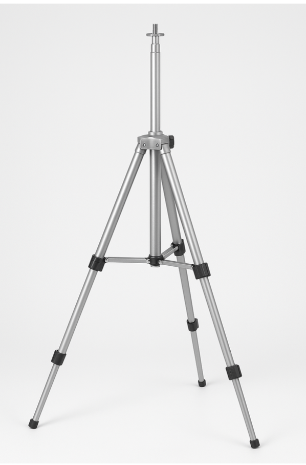

<em>Figure 1 — PolyEdge tripod stand.</em>

---

## 2. Antenna installation (ISAC — ANT1 / ANT2)
1. **Install RF adapters first.** Thread and tighten the N-male adapter on the port labeled
   **ISAC – ANT1** (and ANT2 if used). Hand-tighten until snug, then give a small final turn
   with a wrench.
    **Important:** This adapter is the part you tighten - it is the fixed part on the box.
2. **Place/Seat the antenna** onto the adapter. Make sure the antenna connector is straight and fully engaged.
3. **Tighten the connector** by turning the adapter/nut, not by rotating the antenna. 

      DO NOT TIGHTEN BY TURNING THE ANTENNA

   Always tighten the connector (the adapter) with your hand/wrench so the antenna body does not twist and does not put stress on hte internal coax or the panel connector.
4. **Confirm orientation.** The antenna should be vertical and not touching the top plate or
   bracket. Adjust before final tightening if the bracket is too close.
5. **Stability check.** Because antennas mount on the box (not the tripod), no U-bolt bracket or "Upper/Lower Bracket" alignment is required — just verify the box is stable and connectors are not under side load.

  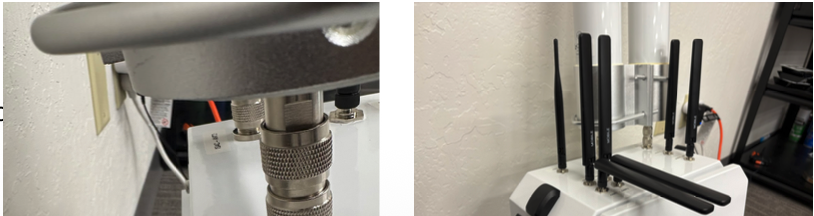

  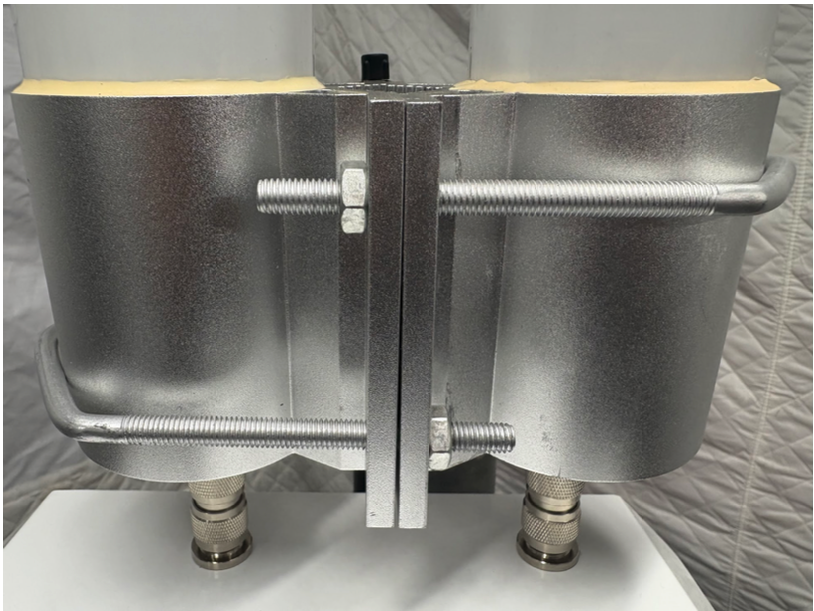

<em>Figure 2 — Antenna mounting (ISAC – ANT1 / ANT2).</em>

---

## 3. Sensor box placement on tripod

### 3.1 Prepare rear mounting brackets
1. Position the sensor unit **face down** on a soft, clean surface to avoid damage during installation
2. Insert the two sliding rail blocks horizontally into the lower and upper
   aluminum rail channels on the rear panel of the sensor enclosure, as
   shown in Figure 3 (left). Ensure they can slide freely for adjustment.
3. Confirm that the sensor back plate is oriented correctly, with the
   beveled corners at the top-left and bottom-right positions, as illustrated in
   Figure 3 (center).
4. Take the stainless-steel V-shaped pole brackets and align them with
   the installed sliding rail blocks. Start with the top bracket.
5. Insert the mounting screws through the holes of the top bracket into the
   rail block and hand-tighten. Repeat the process for the bottom bracket,
   referencing Figure 3 (right) for proper alignment.
6.  Using an Allen key or suitable wrench, tighten all screws securely.
   Ensure both brackets are vertically aligned and firmly seated. Do not
   over-torque to avoid damaging the mounting threads.
7.Verify that the spacing and alignment of both brackets match the marks
   on the tripod or mast where the sensor will be mounted. The assembly is
   now ready for field deployment.

  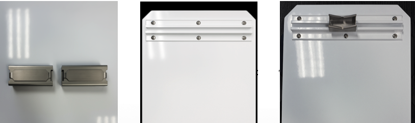

<em>Figure 3 — Bracket installation: rail blocks, rear panel orientation, V-brackets secured.</em>

### 3.2 Install mounting straps
Install the stainless-steel mounting straps. Take the two metal hose clamps (straps) and feed them through the slots in the upper and lower V-brackets. Ensure each strap is evenly wrapped around the bracket and positioned symmetrically across the width of the mounting rail. These straps will secure the sensor assembly to the pole during final installation. Do not fully tighten them as is shown in Figure 4—final adjustment will be completed once the unit is placed against the mast.

  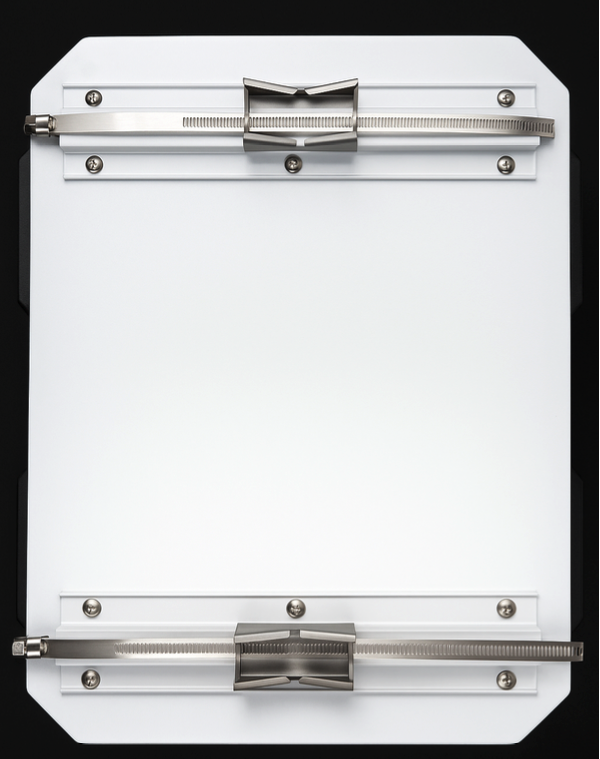

<em>Figure 4 — Mounting straps on pole brackets (loose, pre-final adjustment).</em>

### 3.3 Position support bar
1. Place the adjustable support/cargo bar vertically adjacent to the tripod, ensuring the rubber pads at the top and bottom provide
   secure contact with the floor and ceiling or other surfaces. The bar should be as close as possible to the tripod without obstructing its legs or central pole.
2. Align for box support. The purpose of this support bar is to act as a secondary mounting point or structural support for the     sensor box. Confirm that its height roughly matches the vertical range of the mounting brackets previously installed on the sensor housing.
3. Lock and secure. Use the built-in tightening mechanisms (lever lock and threaded adjustment knob) to secure the support bar in place.

  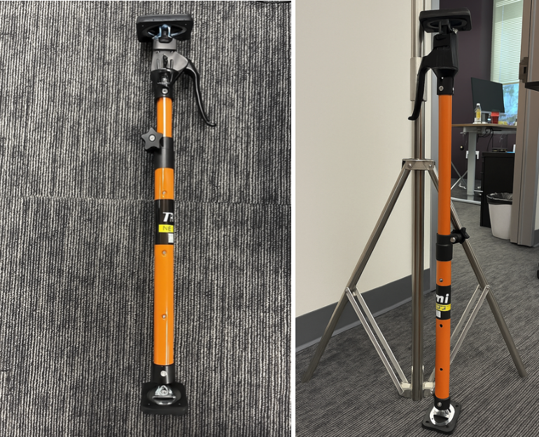

<em>Figure 5 — Support bar adjacent to tripod for sensor housing stabilization.</em>

### 3.4 Mount sensor box (two-person task)
Mounting the Tiami ISAC Sensor Box (Two-Person Task). Carefully lift the Tiami ISAC Sensor Box and position it onto the vertical support bar. While Person 1 holds the sensor box steady against the support bar, Person 2 must adjust the height of the support bar until the upper and lower cabinet brackets align precisely with the pre-marked positions on the tripod mast. Ensure the brackets are flush with the alignment marks before proceeding to secure the clamps.

  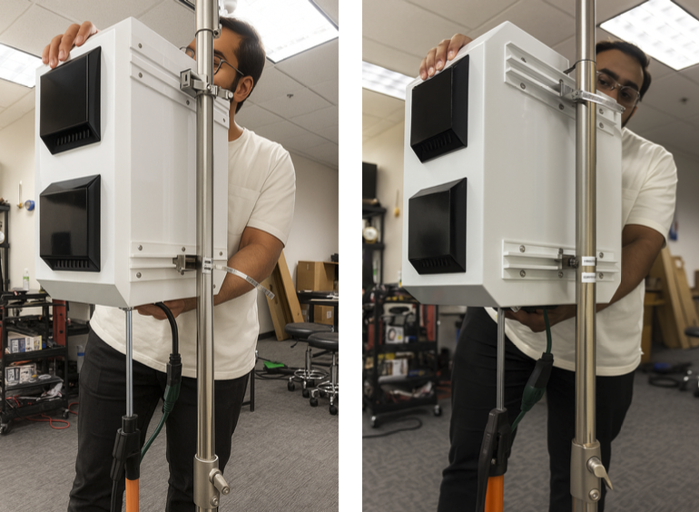

<em>Figure 6 — Manual alignment of sensor box on tripod support structure.</em>

### 3.5 Align support pole for strap tensioning
Position the vertical support pole so that it aligns precisely with the cabinet brackets on the sensor box and the predefined  alignment marks on the tripod mast. This support pole will serve as a structural guide and backing surface for securing the upper and lower mounting straps. Ensure the alignment is accurate, as this will stabilize the sensor box before final tightening.
As illustrated in the Figure 7, the support pole is labeled with the bracket positions (e.g., "Upper cabinet bracket" and "Cabinet lower bracket") to facilitate correct placement. Once the pole is aligned and temporarily held in place, metal straps (hose clamps) are used to secure the sensor to the pole, ensuring a tight and stable fit across both upper and lower mounting points. This alignment is critical to maintain the structural integrity of the sensor during operation and transportation.

  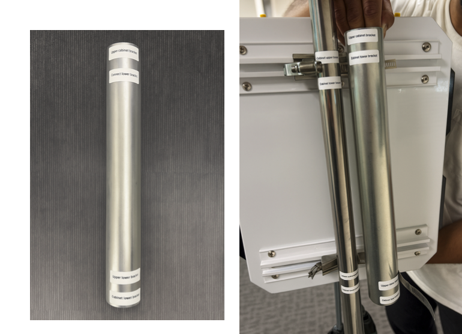

<em>Figure 7 — Support pole aligned with cabinet brackets for strap mounting.</em>

### 3.6 Tighten straps and validate
While Person 1 firmly holds the Tiami ISAC Sensor Box against the support cargo bar to maintain vertical alignment, Person 2 uses a Phillips-head screwdriver to tighten the upper and lower mounting straps. Continue tightening each strap incrementally until the cabinet box is securely fixed in place with no detectable movement. Ensure both brackets remain aligned with the reference marks throughout the process.

  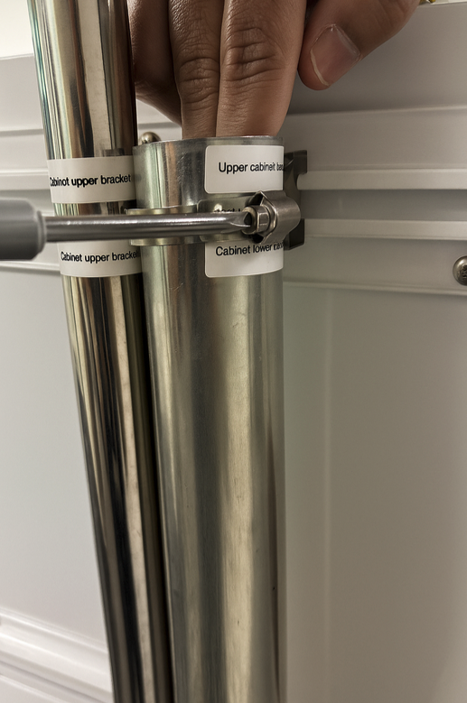

<em>Figure 8 — Tightening mounting straps.</em>

Figure 9 shows the Tiami ISAC Sensor Box fully secured to the vertical tripod mast using two stainless steel mounting straps. The support pole is aligned flush against the cabinet brackets—both upper and lower—ensuring stability and alignment. The labels clearly mark each bracket, and the straps are firmly tightened around the support pole, completing the mechanical installation. This
configuration ensures the sensor box remains securely affixed during operation and transport.

  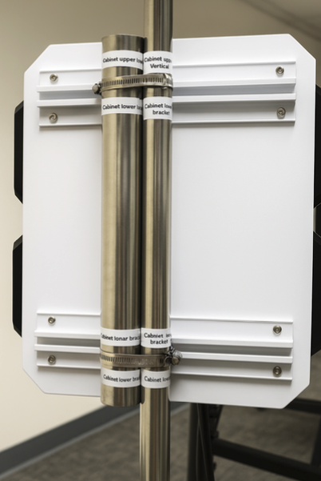

<em>Figure 9 — Final secured mounting of the sensor box.</em>

---

## 4. Sensor powering and startup
1. Open the sensor enclosure. Two internal CPU/computing units are mounted on the shelf, each
   with its own power button: **Power ON 1** (left) and **Power ON 2** (right).
2. At the bottom of the enclosure, below the shelf, locate the pre-installed power plug.
3. Carefully feed the plug end of the power cable through the designated bottom-side opening. Pull the
   cable fully through so it reaches both CPU power inputs before making internal connections.
4. Connect power to both CPUs and press **Power ON 1** and **Power ON 2**.

  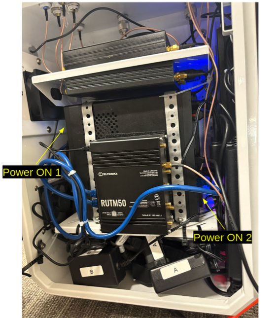

<em>Figure 10 — Internal power cable routing.</em>

  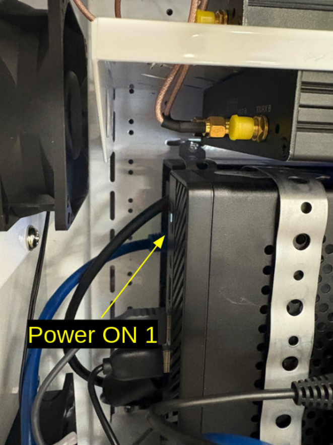

<em>Figure 11 — Power ON 1 location (left side, top CPU).</em>

  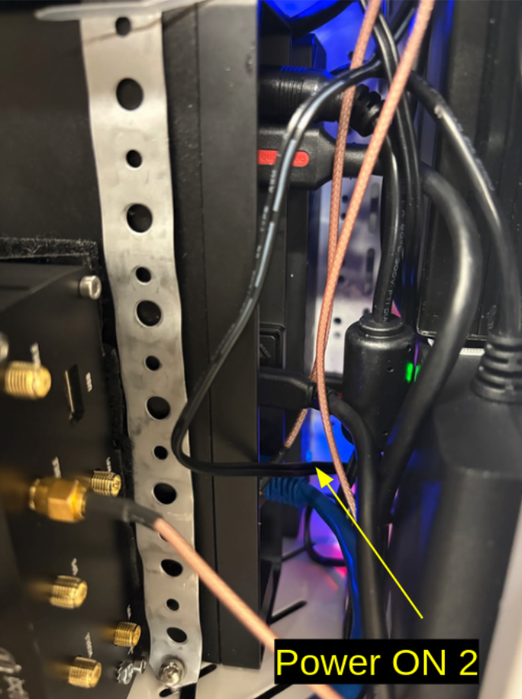

<em>Figure 12 — Power ON 2 location (right side, bottom CPU).</em>

---

## Appendix A : Cord protector - Outdoor Use and Installation Guidelines
The Cord Protector included with the Tiami PolyEdge Sensor is designed to safeguard electrical connections from environmental exposure during outdoor deployments. It provides essential protection against moisture, dust, and physical strain on the power connection.

**Purpose:**
1. To ensure the safe and reliable operation of the sensor in outdoor
environments.
2. To minimize the risk of water ingress at the power connection interface.

**Installation:**
1. Open the cord protector by unscrewing or separating the two interlocking halves, depending on the model
2. Insert the power cable, ensuring that the plug is seated within the designated enclosure area.
3. Close and secure the Cord Protector around the cable using the integrated fastening mechanism (e.g., screw lock, clamp, or gasket seal).
4. Confirm a tight seal around the cable entry and exit points to ensure full environmental protection
5. Position the protector at or near ground level where the cable exits the sensor box, keeping it off direct wet surfaces when possible.

**Caution:**
- Do not submerge the cord protector in water.
- Always follow the printed instructions on the device for sealing and compliance with outdoor electrical safety compliance.

For best results, visually inspect the Cord Protector after installation to ensure
that all seals are intact and the enclosure is properly closed.

---
